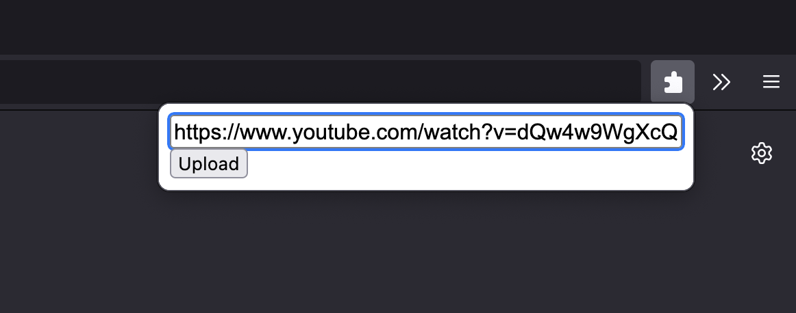

# Uploader plugin
A Firefox extension that takes a video-URL and uploads the video to a YouTube channel using the [Uploader-server](https://github.com/EdvardSire/uploader-server) backend

## manifest.json
Creates the extension

## popup.html
Bare-bones input field and upload button

## main.js
Sends a POST request with the video-URL
